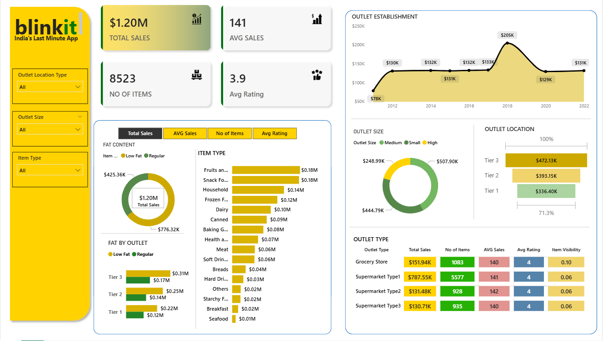

# 🛒 Blinkit Data Analysis Dashboard  

An end-to-end data analytics project to uncover insights from Blinkit’s sales performance, customer satisfaction, and inventory distribution. The project uses Power BI for dashboard creation, Power Query for data transformation, and DAX for building interactive KPIs and business insights.

This repository demonstrates how raw retail and grocery sales data can be transformed into a dynamic business intelligence dashboard that helps stakeholders monitor sales trends, customer preferences, outlet performance, and inventory optimization.  

---

## 🛠 Tech Stack
- **Power BI Desktop**: For creating interactive dashboards  
- **Power Query**: Data cleaning & transformation  
- **DAX (Data Analysis Expressions)**: For calculated columns and measures  
- **PostgreSQL**: Solved analytical queries for business questions  
- **Excel**: Data source & preprocessing  

---

## 📂 Data Source
A **synthetic dataset** used in this project contains Blinkit grocery sales data, including outlet information, item categories, customer ratings, sales performance and inventory details.  

---

## ✨ Features & Highlights

### 🏢 **Business Problem**  
Blinkit wants to analyze its sales performance, customer satisfaction, and inventory distribution to identify growth opportunities and improve operational efficiency.  

### 🎯 **Goal of the Dashboard**
To provide stakeholders with:  
- Clear **KPIs and sales trends** for business monitoring  
- Insights into **customer preferences & outlet performance**  
- Data-driven decisions for **inventory and sales optimization**   

## 🔑 **Key Visuals (Brief Walkthrough)**  

### 📈 Total Sales & KPI Overview 
Provides a high-level summary of total sales, average sales, number of items, and average ratings. 

---

### 🏬 Outlet Establishment Trend  
Shows how outlet establishments have grown over the years.  

---

### 🥛 Fat Content & Outlet Analysis  
Analyzes customer preferences based on low-fat and regular products across outlets.  

---

### 🌍 Outlet Location & Size Analysis  
Measures service quality across vehicle types.  

---

## 📊 **Business Impact & Insights**
- Tier 3 outlets generated the highest sales contribution among all outlet locations.  
- Fruits, snacks, and household items were among the top-performing categories.  
- Regular-fat products contributed more sales compared to low-fat products.  
- Medium-sized outlets showed stronger overall sales performance.
- Customer ratings remained consistent across outlet types, indicating stable service quality.  

---

## 👩‍💻 Author
**Rishita Kumari**  

📅 April 2026  

---
